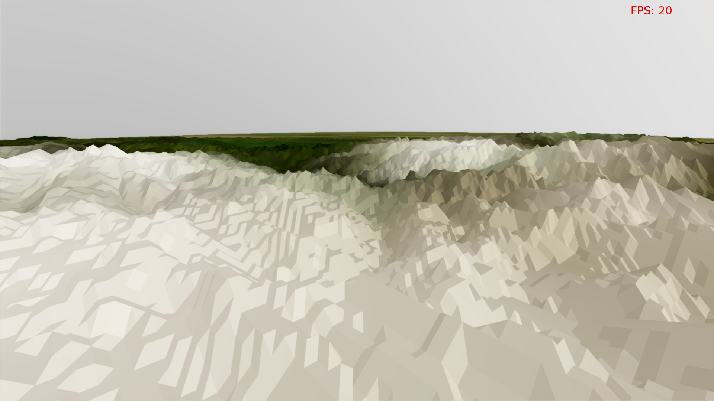
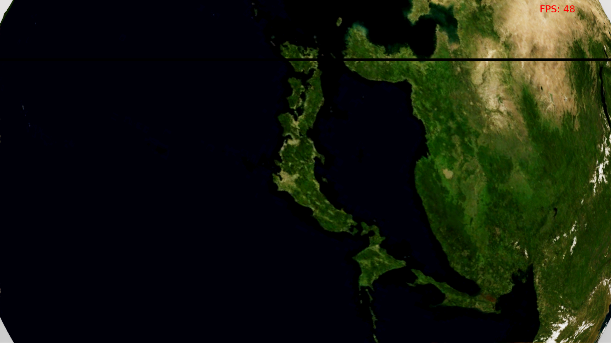
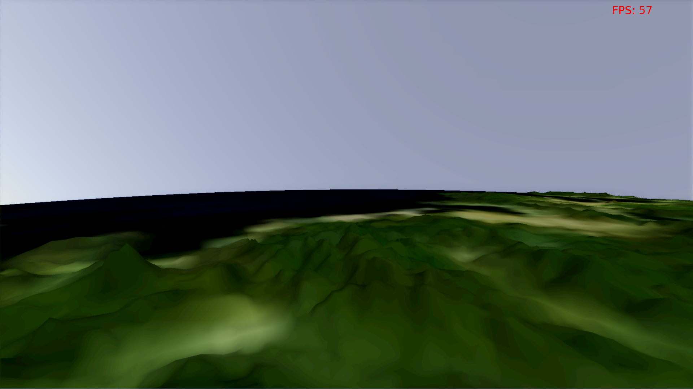

Land of Önlab
=============

A kód a korábban megírt Land of Dreams nevű félkész játékmotoromat használja, ami nem biztos, hogy jó ötlet volt, de most már így marad :)

Függőségek:
```
libmagick++-dev clang cmake xorg-dev libglu1-mesa-dev libfreetype6-dev
```

A master branch állapota sajnos elég siralmas, ennél sokkal több mindent csináltam, ide csak azok a kódok kerülnek be, amik tényleg működnek is, és bug menetesek.

Néhány kép (a csíkok csak screenshot készítés és a bugos vsync kombinációjának köszönhetőek):






Jelenleg működő featureök:
-------------------------
* Gyakorlatilag tetszőleges méretű magassági-mező geometria real-time megjelenítése.
  * 200k * 200k simán megy 60FPS-el egy Intel HD Graphics 4000-en, ha a heightmap procedúrális, és nincs csilli-villi shading.
  * A demóban csak 20k * 10k geometira látható, mert csak ekkora heightmap fért fel a GPUra streamelés nélkül (a memória -> GPU streamlés még nincs kész).
  * A rajzoló algoritmus a CDLOD-on alapul, de Filip Strugar ötletétől sok helyen eltér - pl. az direktbe nem is alkalmazható gömb felszínre.
* Tetszőleges méretű textúra szinkron streamelése háttértárról rendszermemóriába (és kifele)
  * A jelenlegi demóban egy 170k * 80k (15 GB tömörítetlenül) heightmap van streamelve. Egy időpillanatban általában 7-800 db kb 340*180-es képre van szükség, bár jelenleg semmire nem használom fel a betöltött textúrákat.
  * Ez nagyrészt belefér még a 60 FPS-es renderelés mellé, kivéve ha hirtelen nagyon megváltozik a kamera pozíciója, attól be tud lassulni.

Amin jelenleg dolgozok:
----------------------
* Texture buffer alapú streamelés rendszermemóriából GPU-ra (szinkron)
* Normálisabb kamerák + megoldani, hogy ne balra legyen észak...
* Egy normálisabb méretű diffúz textúra adathalmaz beszerzése.


Egyelőre csak elvben működő, de már lekódolt featureök:
-------------------------------------------------------
* Aszikron streamelés háttértárról memóriába
* Sparse textúrák használata
* Pontos és hatékony metszet számítás egy gömb és egy gömbcikkely között (ez a LOD algoritmus alapja...)

Terv a jövőre nézve:
-------------------
* Árnyékok
* Növényzet
