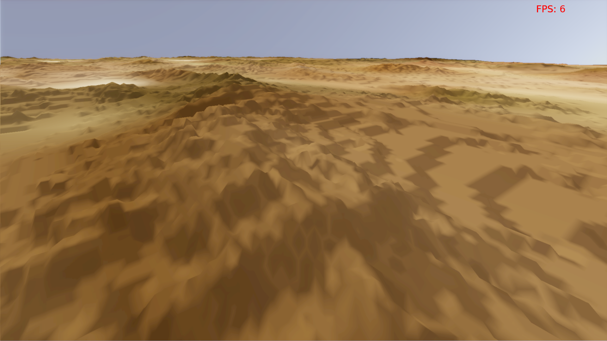
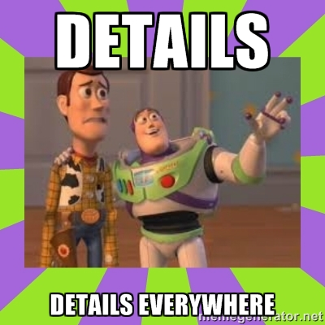

Land of Önlab
=============

A kód a korábban megírt Land of Dreams nevű félkész játékmotoromat használja, ami nem biztos, hogy jó ötlet volt, de most már így marad :)

Függőségek:
```
libmagick++-dev clang cmake xorg-dev libglu1-mesa-dev libfreetype6-dev
```

A jelenlegi állapot:
--------------------
* 172800x86400 heightmap streamelése működik, nevetségesen sok részlet elérhető, de az algoritmus szándékosan nagyon egyszerű (így is rémálom volt debugolni), ezért nevetségesen lassú is (ebből az állapotból kb 5-10szeres sebességnövekedés még viszonylag könnyen elérhető). 




Amin jelenleg dolgozok:
----------------------
* Elfogadhatóbb teljesítményű streamelés
* Normálisabb kamerák
* Egy normálisabb méretű diffúz textúra adathalmaz beszerzése.


Egyelőre csak elvben működő, de már lekódolt featureök:
-------------------------------------------------------
* Aszikron streamelés háttértárról memóriába
* Sparse textúrák használata
* Pontos és hatékony metszet számítás egy gömb és egy gömbcikkely között (ez a LOD algoritmus alapja...)

Terv a jövőre nézve:
-------------------
* Árnyékok
* Növényzet
