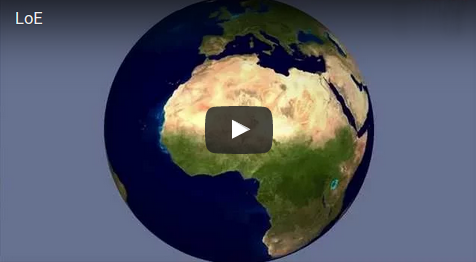
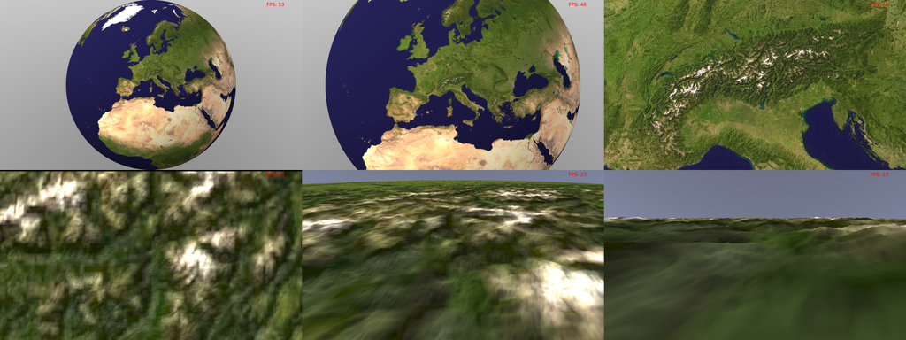

Land of Earth
=============

For a newer version of this project, see [Land of Earth Reloaded](https://github.com/Tomius/ReLoEd).

Land of Earth is global spherical terrain renderer that is based on a 172800 * 86400 heightmap, and it works realtime. It is an "extension" of [Filip Strugar's CDLOD concept](http://www.vertexasylum.com/downloads/cdlod/cdlod_latest.pdf), with texture streaming of course.

[](https://youtu.be/ebaR9mluvqY)



Dependencies (linux only):
-------------------------
```
libmagick++-dev clang cmake xorg-dev libglu1-mesa-dev libfreetype6-dev
```

Camera usage (press space to switch between them):
----------------------------------------------------
* FPS camera
  * WASD keys: position
  * mouse move: camera direction
  * mouse scroll: movement speed
* Sphere viewer camera (default):
  * mouse move: position
  * mouse scroll: zoom

